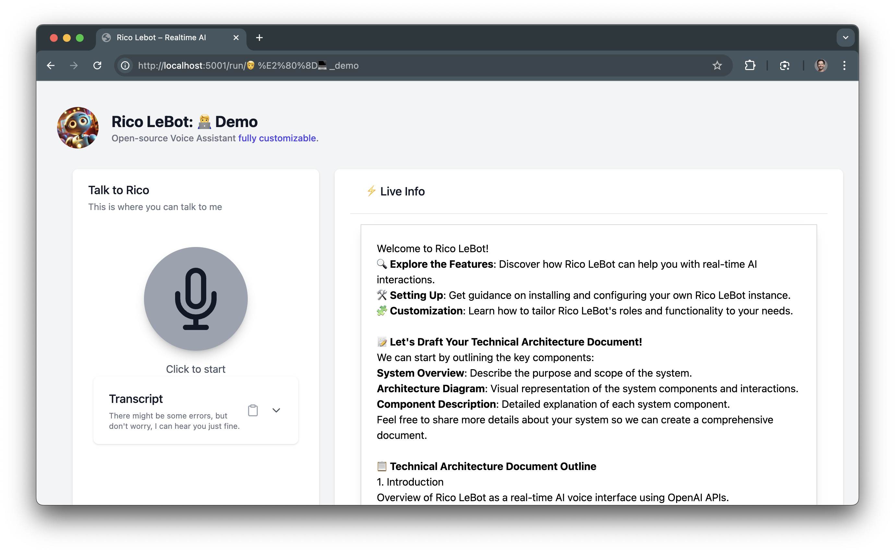

#  Rico LeBot

**Rico LeBot** is an open-source, fully customizable Realtime Voice AI assistant built with OpenAI's Realtime API, Flask, TailwindCSS and LiveKit. It enables the creation of distinct roles for AI assistants, allowing tailored interactions and functionalities to suit various use cases.

## Why?

Building real-time AI experiences is fundamentally different from traditional text-based LLM integrations, requiring distinct architectural considerations:  
- **Bidirectional Streams**: Real-time, long-form client-server and server-client data flows.
- **Beyond Chat UI**: Interactions involve mixed inputs like microphone, camera, and text, not just text token streams.

> The project lays the groundwork for building a robust foundation for a Realtime AI assistant, emphasizing clarity with minimal coding.

**Challenges Addressed**:
- **WebRTC Over Websockets**: Ensures robust long-form connections for audio/video streams.
- **UI Exploration**: Designing interfaces that fluidly integrate mixed user inputs (voice and text for now) and agent outputs (voice and RPC).

**[Architecture Design](docs/agent_architecture.md)**
- **Frontend-Backend Separation**: Clear code boundaries to simplify development and security.
- **Backend-Only Secrets**: Safeguard API keys and sensitive logic by isolating them from the frontend.


*You are free and encouraged to use it as it is, modify roles to learn, hack, discover, play in whatever direction you may want and repurpose it for your own use case.*


## Demo



## Features

- **Web Interface**: Intuitive and responsive UI built with HTML, Tailwind CSS, and Alpine.js.
- **Real-time Communication**: Leveraging LiveKit for seamless audio (and soon video) streaming.
- **AI-Powered Responses**: Integration with OpenAI's language models for intelligent and context-aware interactions.
- **Transcription and Summarization**: Recap and summarize conversation transcripts for easy reference.
- **Customizable Roles**: Define various roles for the assistant, each with unique instructions and configurations.
- **Session Management**: Handle user sessions with capabilities to start, terminate, and summarize conversations.
- **Agent Authentication**: Manage Flask sessions and LiveKit tokens.

## Installation

### Prerequisites

- **Python 3.9+**: Ensure Python is installed on your system. You can download it from [python.org](https://www.python.org/downloads/).
- **TailwindCSS**: Beautiful interface in no time. Follow the [installation guide of Tailwind CLI](https://tailwindcss.com/docs/installation)
- **LiveKit Account**: Sign up for LiveKit to obtain API credentials. [OpenAI Realtime API Quickstart](https://docs.livekit.io/agents/quickstarts/s2s/)
- **OpenAI API Key**: Obtain your API key from [OpenAI](https://platform.openai.com/settings/organization/api-keys).

The fastest way to start and try Rico Lebot is using Docker

## 🛠️ Configuration

### Pre-requisites:
- **LiveKit Account**: Sign up for LiveKit to obtain API credentials. [LiveKit Realtime API Quickstart](https://docs.livekit.io/agents/quickstarts/s2s/)
- **OpenAI API Key**: Obtain your API key from [OpenAI](https://platform.openai.com/settings/organization/api-keys).

### Clone the Repository

```bash
git clone https://github.com/xbasset/rico-lebot.git
cd rico-lebot
```


### Configure Environment Variables

Create a `.env` file in the root directory based on the provided `.env.example`:

```bash
cp .env.example .env
```

Open the `.env` file and populate it with your credentials:

```env
# .env

# OpenAI Credentials
OPENAI_API_KEY=your_openai_api_key

# LiveKit Credentials
LIVEKIT_API_KEY=your_livekit_api_key
LIVEKIT_API_SECRET=your_livekit_api_secret
LIVEKIT_URL=your_livekit_server_url
```

## 🚀 Run with Docker

You can build the Docker image named `rico` and run it using the following commands.

### Build the Docker Image

```bash
docker build -t rico .
```

### Run the Docker Container

```bash
docker run -p 5001:5001 --name rico rico
```
> **Congratz**.
> 🎉 You're all set!
> Start using Rico Lebot: 👉 http://localhost:5001


## Want more?
For a deeper dive into setting up and customizing Rico LeBot, here are some useful links:

🔗 📚 [Main Documentation](docs/index.md): This page provides an overview of the project, including architecture, features, and challenges addressed.

🔗 [Getting Started Guide](docs/getting_started.md): This guide will walk you through the process of installing and running a demo instance of Rico LeBot. It's the perfect starting point for new users.

🔗 [Agent Architecture](docs/agent_architecture.md): Learn about the technical architecture of Rico LeBot, including the system's components and interactions.

🔗 [Customize Roles](docs/roles.md): Learn how to create, update, and tailor the roles of your AI assistants to fit different use cases. This documentation will guide you through the customization process to enhance Rico LeBot's capabilities.

## License

This project is licensed under the [MIT License](LICENSE).

