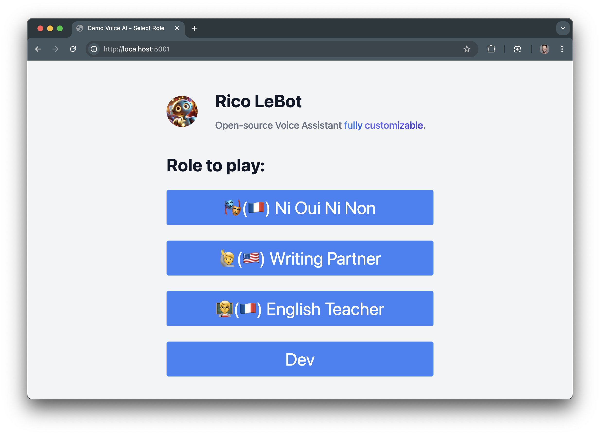
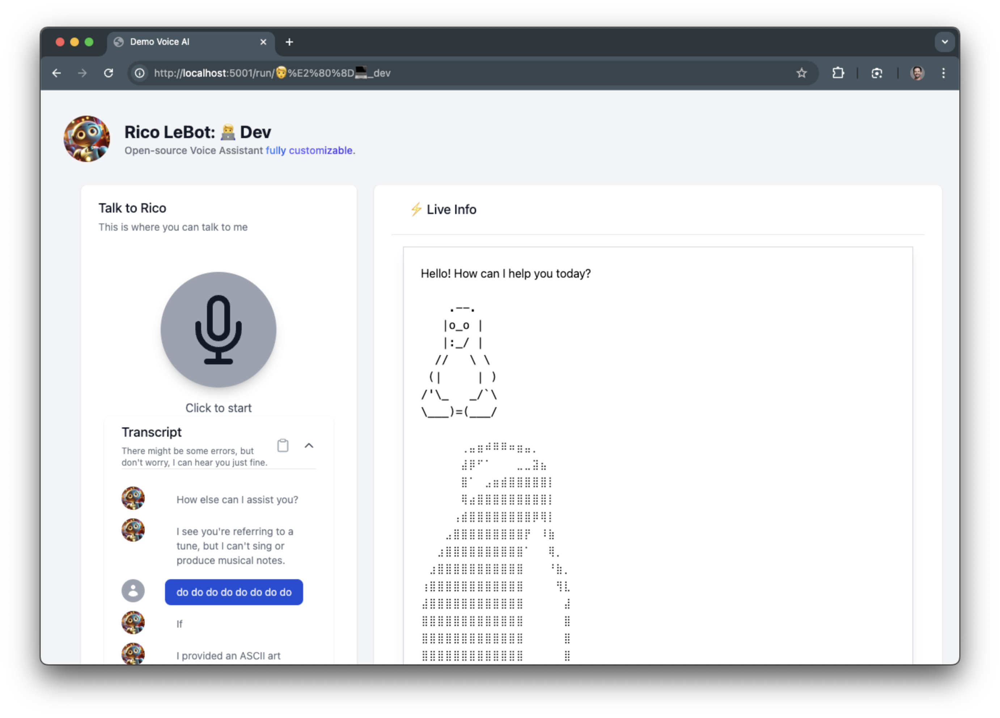

#  Rico LeBot

**Rico LeBot** is an open-source, fully customizable voice assistant built with Flask, LiveKit, and OpenAI's language models. It enables the creation of distinct roles for AI assistants, allowing tailored interactions and functionalities to suit various use cases.

## Why?

Building real-time AI experiences is fundamentally different from traditional text-based LLM integrations, requiring distinct architectural considerations:  

**Key Differences**:
- **Bidirectional Streams**: Real-time, long-form client-server and server-client data flows.
- **Beyond Chat UI**: Interactions involve mixed inputs like microphone, camera, and text, not just text token streams.

**Challenges Addressed**:
- **WebRTC Over Websockets**: Ensures robust long-form connections for audio/video streams.
- **UI Exploration**: Designing interfaces that fluidly integrate mixed user inputs (voice and text for now) and agent outputs (voice and RPC).

**Architecture Design**
- **Frontend-Backend Separation**: Clear code boundaries to simplify development and security.
- **Backend-Only Secrets**: Safeguard API keys and sensitive logic by isolating them from the frontend.

## Features

- **Web Interface**: Intuitive and responsive UI built with HTML, Tailwind CSS, and Alpine.js.
- **Real-time Communication**: Leveraging LiveKit for seamless audio (and soon video) streaming.
- **AI-Powered Responses**: Integration with OpenAI's language models for intelligent and context-aware interactions.
- **Transcription and Summarization**: Recap and summarize conversation transcripts for easy reference.
- **Customizable Roles**: Define various roles for the assistant, each with unique instructions and configurations.
- **Session Management**: Handle user sessions with capabilities to start, terminate, and summarize conversations.
- **Agent Authentication**: Manage Flask sessions and LiveKit tokens.

## Demo





## Installation

### Prerequisites

- **Python 3.9+**: Ensure Python is installed on your system. You can download it from [python.org](https://www.python.org/downloads/).
- **TailwindCSS**: Beautiful interface in no time. Follow the [installation guide of Tailwind CLI](https://tailwindcss.com/docs/installation)
- **LiveKit Account**: Sign up for LiveKit to obtain API credentials. [OpenAI Realtime API Quickstart](https://docs.livekit.io/agents/quickstarts/s2s/)
- **OpenAI API Key**: Obtain your API key from [OpenAI](https://platform.openai.com/account/api-keys).

### Clone the Repository

```bash
git clone https://github.com/xbasset/rico-lebot.git
cd rico-lebot
```

### Setup Virtual Environment

It's recommended to use a virtual environment to manage dependencies.

```bash
python3 -m venv .venv
source .venv/bin/activate  # On Windows, use .venv\Scripts\activate
```

### Install Dependencies

#### Python Dependencies

```bash
pip install -r requirements.txt
```

### Configure Environment Variables

Create a `.env` file in the root directory based on the provided `.env.example`:

```bash
cp .env.example .env
```

Open the `.env` file and populate it with your credentials:

```env
# .env

# Flask Secret Key
APP_SECRET_KEY=your_flask_secret_key

# LiveKit Credentials
LIVEKIT_API_KEY=your_livekit_api_key
LIVEKIT_API_SECRET=your_livekit_api_secret
LIVEKIT_URL=your_livekit_server_url

# OpenAI Credentials
OPENAI_API_KEY=your_openai_api_key
LLM_MODEL=your_preferred_openai_model  # e.g., gpt-4
```

## Usage

### Running the Application

Start the Flask application with SocketIO enabled.

```bash
python app.py
```

The application will be accessible at `http://localhost:5001`.

### Running the Agent

In a separate terminal window, ensure your virtual environment is activated and run the agent script.

```bash
python core/agent.py
```

The agent connects to the LiveKit room and starts interacting based on the defined role.

## Configuration

### Defining Roles

Roles are defined within the `roles/` and `roles/private` directory. Each role has its own set of configuration and instruction files. The `private` directory is a subfolder for your private roles out of the git scope (.gitignore)

#### Role Components

- **`agent.instruct`**: Instructions guiding the AI's behavior and available functions.
- **`recap.instruct`**: Instructions for summarizing conversations.
- **`config.py`**: Role-specific configurations (e.g., voice settings).
- **`saved.txt`**: Logs of saved conversation snippets.

#### Adding a New Role

1. Create a new folder under `roles/` or `roles/private` with the desired role name (e.g., `roles/customer_support`). 

2. Add the following files:

   - `agent.instruct`: Define the AI behavior and available functions.
   - `recap.instruct`: Provide instructions for summarizing transcripts.
   - (optional) `config.py`: Specify role-specific settings.

**Example: `roles/dev/agent.instruct`**

```plaintext
You are Rico Lebot. A direct, straight to the point AI Assistant. You are currently helping the user to debug your functionalities.

You can call different functions:
- `terminate_session`: Called when the user asks to terminate the conversation. This function will end the conversation.
- `show`: Called when you want to display written information. This function displays interpreted information in Markdown on the UI.
- `greet`: Called as soon as entering a conversation. This function starts the conversation.
- `save`: Called to save the current state of the conversation. This function will save the current state of the conversation.

Speak fast, and respond to the user according to their requests.
```

### LiveKit Integration

Ensure you have a LiveKit account and have obtained the necessary API credentials. These should be set in the `.env` file as shown above.

### OpenAI Integration

Set your OpenAI API key and the `MultimodalAgent` from the livekit library will manage the selection of the 4o-realtime-model.

## Directory Structure

The choices of a Flask Backend and HTML + TailwindCSS + AlpineJS Frontend is 

```
RicoLeBot/
├── app.py
├── core/
│   ├── agent.py
│   └── config.py
├── extensions.py
├── roles/
│   ├── dev/
│   │   ├── agent.instruct
│   │   ├── config.py
│   │   ├── recap.instruct
│   │   └── saved.txt
│   └── ... # Additional roles
├── static/
│   ├── js/
│   │   ├── voice-ui.js
│   │   └── constants.js
│   ├── css/
│   │   └── output.css
│   └── images/
│       └── voice-ai.jpeg
├── templates/
│   ├── index.html
│   └── run.html
├── .gitignore
├── .env
├── .env.example
├── requirements.txt
└── README.md
```

## API Endpoints

### Home Page

- **URL**: `/`
- **Method**: `GET`
- **Description**: Renders the home page where users can select a role for the assistant.

### Run Role

- **URL**: `/run/<role>`
- **Method**: `GET`
- **Description**: Renders the interaction page for the specified role –i.e. name of the subfolder.

### Get Agent Token

- **URL**: `/api/agent/auth`
- **Method**: `GET`
- **Description**: Generates and returns an authentication token for the agent to connect to LiveKit.

### Recap Conversation

- **URL**: `/api/recap`
- **Method**: `POST`
- **Description**: Receives conversation transcription and returns a summarized recap.

### Save Information

- **URL**: `/api/save`
- **Method**: `POST`
- **Description**: Saves specific information from the conversation to a file.

## Frontend Overview

The frontend is built using HTML, Tailwind CSS for styling, and Alpine.js for interactivity. It communicates with the backend via API endpoints to handle real-time voice interactions.


## Developement: 
### Node.js Dependencies for TailwindCSS rebuild

```bash
npm install
```

Don't forget to use the Tailwind tools to update the CSS when you update the frontend.

```bash
npx tailwindcss -i static/css/input.css -o static/css/output.css --watch
```


### Key Components

- **`index.html`**: Landing page where users select the role for Rico LeBot.
- **`run.html`**: Main interaction page where users can communicate with the assistant.
- **`static/js/voice-ui.js`**: Handles the Voice UI interactions, including connecting to LiveKit rooms, managing transcriptions, and updating the UI based on conversation states.
- **`static/css/output.css`**: Compiled Tailwind CSS for styling the frontend components.

### Contributing

Contributions are welcome! Whether it's reporting bugs, suggesting features, or submitting pull requests, your support helps improve Rico LeBot.


1. **Fork the Repository**: Click the "Fork" button at the top-right corner of the repository page.
2. **Clone Your Fork**:

   ```bash
   git clone https://github.com/xbasset/rico-lebot.git
   cd rico-lebot
   ```

3. **Create a New Branch**:

   ```bash
   git checkout -b feature/YourFeatureName
   ```

4. **Make Your Changes**: Implement your feature or fix.
5. **Commit Your Changes**:

   ```bash
   git commit -m "Add feature: YourFeatureName"
   ```

6. **Push to Your Fork**:

   ```bash
   git push origin feature/YourFeatureName
   ```

7. **Open a Pull Request**: Navigate to the original repository and click "New Pull Request".

## License

This project is licensed under the [MIT License](LICENSE).

---

## Contact

For questions, suggestions, or support, please open an issue on the [GitHub repository](https://github.com/xbasset/rico-lebot/issues) or contact [youremail@example.com](mailto:youremail@example.com).

---

*Happy Coding! 🚀*