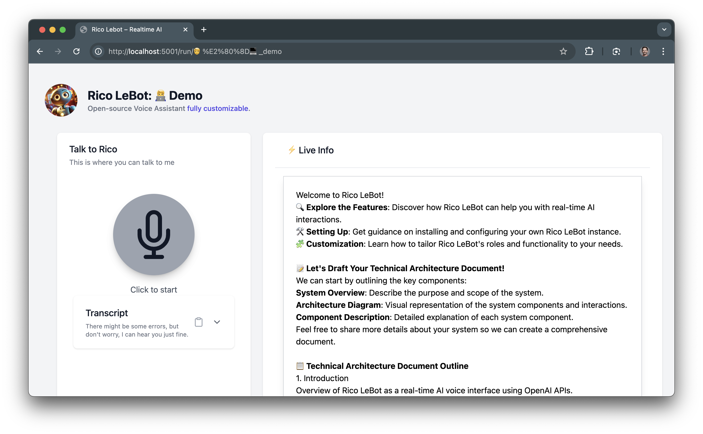

# Technical Architecture Documentation

Rico LeBot is an innovative real-time AI voice interface designed to harness the power of OpenAI's language models. This project aims to transition from a prototype to a Minimum Viable Product (MVP), addressing core challenges in reliable communication and dynamic user interaction.

##  System Architecture
### Overview of the forward architecture.
The architecture consists of two main components: the Web App (backend and frontend) and the Agent, working seamlessly to deliver an efficient AI voice interface.

### Web App

Serves as the core backend, built with Python Flask, exposing REST APIs and rendering the user interface using Jinja templates.
Incorporates a dynamic frontend developed with JavaScript, utilizing Alpine.js for state management and Tailwind CSS for a responsive design.
Utilizes WebRTC technology through LiveKit to ensure reliable long-term connections for audio and video streams, working alongside WebSockets.

### Agent
A Python script responsible for managing agent workers in LiveKit.
Acts as a bridge between the backend and frontend, ensuring smooth communication and connection management.
This architecture allows Rico LeBot to provide an interactive, real-time AI experience, efficiently handling voice inputs and outputs. The following diagram illustrates the system's components and their interactions.

### Architecture Diagram

Visual representation using LiveKit's toolkit.


source: https://docs.livekit.io/agents/build/anatomy/

## Directory Structure

The choices of a Flask Backend and HTML + TailwindCSS + AlpineJS Frontend is 

```
RicoLeBot/
├── app.py
├── core/
│   ├── agent.py
│   └── config.py
├── extensions.py
├── roles/
│   ├── dev/
│   │   ├── agent.instruct
│   │   ├── config.py
│   │   ├── recap.instruct
│   │   └── saved.txt
│   └── ... # Additional roles
├── static/
│   ├── js/
│   │   ├── voice-ui.js
│   │   └── constants.js
│   ├── css/
│   │   └── output.css
│   └── images/
│       └── rico-lebot.jpeg
├── templates/
│   ├── index.html
│   └── run.html
├── .gitignore
├── .env
├── .env.example
├── requirements.txt
└── README.md
```

## Main Components
### Web App

The Web App acts as the primary interface for users and managing the backend processes:

#### Directory Structure

The choices of a Flask Backend and HTML + TailwindCSS + AlpineJS Frontend is 

```
RicoLeBot/
├── app.py
├── core/
│   ├── agent.py
│   └── config.py
├── extensions.py
├── roles/
│   ├── demo/
│   │   ├── agent.instruct
│   │   ├── config.py
│   │   ├── recap.instruct
│   │   └── saved.txt
│   └── ... # Additional roles
├── static/
│   ├── js/
│   │   ├── voice-ui.js
│   │   └── constants.js
│   ├── css/
│   │   └── output.css
│   └── images/
│       └── rico-lebot.jpeg
├── templates/
│   ├── index.html
│   └── run.html
```

#### Backend
Built with Python Flask, the backend serves as the foundation, handling HTTP requests and routing.
Exposes REST APIs for communication between the frontend, agent, and external services.
Utilizes Jinja templates for rendering dynamic HTML, integrating with the frontend seamlessly.

##### API Endpoints

###### Home Page

- **URL**: `/`
- **Method**: `GET`
- **Description**: Renders the home page where users can select a role for the assistant.

###### Run Role

- **URL**: `/run/<role>`
- **Method**: `GET`
- **Description**: Renders the interaction page for the specified role –i.e. name of the subfolder.

###### Get Agent Token

- **URL**: `/api/agent/auth`
- **Method**: `GET`
- **Description**: Generates and returns an authentication token for the agent to connect to LiveKit.

###### Recap Conversation

- **URL**: `/api/recap`
- **Method**: `POST`
- **Description**: Receives conversation transcription and returns a summarized recap.

###### Save Information

- **URL**: `/api/save`
- **Method**: `POST`
- **Description**: Saves specific information from the conversation to a file.


#### Frontend
Developed using JavaScript, the frontend delivers an interactive user experience.
Alpine.js is employed for state management, offering a lightweight framework for dynamic behavior.
Tailwind CSS is used for styling, providing a customizable and responsive design.
Integrates WebRTC via LiveKit to support real-time audio (and future video) streaming, enhancing the interactive capabilities of Rico LeBot.



##### Key Components

- **`index.html`**: Landing page where users select the role for Rico LeBot.
- **`run.html`**: Main interaction page where users can communicate with the assistant.
- **`static/js/voice-ui.js`**: Handles the Voice UI interactions, including connecting to LiveKit rooms, managing transcriptions, and updating the UI based on conversation states.
- **`static/css/output.css`**: Compiled Tailwind CSS for styling the frontend components.

##### Node.js Dependencies for TailwindCSS rebuild

```bash
npm install
```

Don't forget to use the Tailwind tools to update the CSS when you update the frontend.

```bash
npx tailwindcss -i static/css/input.css -o static/css/output.css --watch
```


### Agent

The Agent in Rico LeBot plays a crucial role in managing the AI assistant's real-time interactions. Here's a detailed look at its functions:

#### Agent Management

The agent is a Python script that orchestrates the activities of agent workers within the LiveKit environment.
It ensures efficient allocation and management of resources for handling multiple concurrent sessions.

#### Communication Bridge

Acts as an intermediary between the backend and frontend, facilitating smooth communication.
Manages signaling and data exchange between the Web App and LiveKit for real-time audio streams.

#### Connection Handling

Maintains the stability and reliability of long-term connections, crucial for uninterrupted sessions.
Implements mechanisms for session initiation, termination, and recovery in case of disruptions.

#### Integration with OpenAI APIs

Utilizes OpenAI's language models to generate intelligent, context-aware responses.
Processes user inputs, forwards them to the language model, and returns the outputs to the frontend.
The Agent component is vital for ensuring that Rico LeBot delivers a seamless and responsive AI experience, with robust connection management and efficient communication pathways.


## Going further
For a deeper dive into setting up and customizing Rico LeBot, here are some useful links:

🔗 Getting Started Guide: This guide will walk you through the process of installing and running a demo instance of Rico LeBot. It's the perfect starting point for new users.

🔗 Customize Roles: Learn how to create, update, and tailor the roles of your AI assistants to fit different use cases. This documentation will guide you through the customization process to enhance Rico LeBot's capabilities.